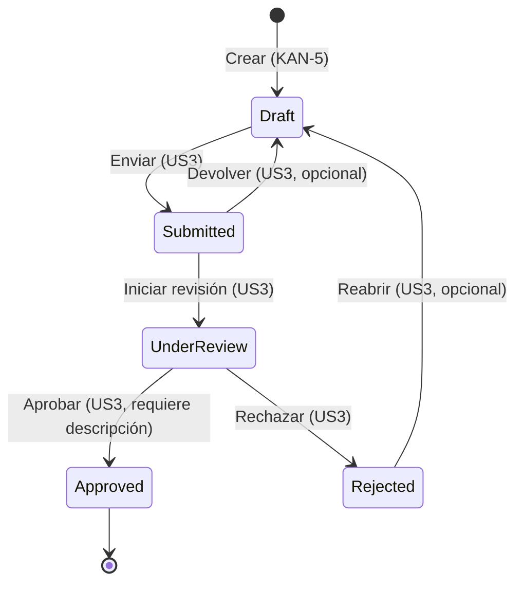

# Modelo de datos – 001 Crear siniestro auto (KAN-5)

> Parte del **CÓMO**. Deriva de `spec.md`; contrato HTTP en [`contracts/openapi.yaml`](contracts/openapi.yaml).

## 1. Entidad `Claim` (siniestro)

Código: `backend/src/ClaimsManagement.Domain/Entities/Claim.cs`.

| Campo | Tipo (.NET) | Tipo (API) | Obligatorio | Regla | REQ |
|---|---|---|---|---|---|
| `Id` | `Guid` | `string (uuid)` | Generado | Único, generado al crear | REQ-001-07 |
| `PolicyNumber` | `string` | `string` | Sí | No vacío / no solo espacios | REQ-001-01, REQ-001-02 |
| `ClaimDate` | `DateTime` (se usa solo la parte fecha) | `string (date)` | Sí | ≤ hoy en Europe/Madrid, por día natural | REQ-001-04 |
| `ClaimType` | `ClaimType` | `string (enum)` | Sí | Valor del catálogo | REQ-001-06 |
| `VehiclePlate` | `string` | `string` | Sí | No vacío | REQ-001-01 |
| `InsuredName` | `string` | `string` | Sí | No vacío | REQ-001-01 |
| `Phone` | `string` | `string` | Sí | No vacío | REQ-001-01 |
| `Address` | `string` | `string` | Sí | No vacío | REQ-001-01 |
| `PostalCode` | `string` | `string` | Sí | `^\d{5}$` | REQ-001-05 |
| `Description` | `string` | `string` | Sí | No vacío | REQ-001-01 |
| `Status` | `ClaimStatus` | `string (enum)` | Generado | `Draft` al crear | REQ-001-03 |
| `CreatedAt` | `DateTime` (UTC) | `string (date-time)` | Generado | Instante de alta en UTC | REQ-001-07 |

Invariantes:
- `Claim.Create(...)` es la única forma de crear un siniestro y siempre fija `Status = Draft` y un `Id` nuevo.
- Un `Claim` solo se crea si `CreateClaimValidator` no devuelve errores (REQ-001-09).

## 2. Enumeración `ClaimType`

| Valor | Etiqueta UI | Código |
|---|---|---|
| `Colision` | Colisión | 0 |
| `Robo` | Robo | 1 |
| `Incendio` | Incendio | 2 |
| `Cristales` | Cristales | 3 |

Cualquier otro valor se rechaza (C-001-07).

## 3. Enumeración `ClaimStatus` y máquina de estados

En KAN-5 **solo se implementa la creación en `Draft`**. La máquina de estados completa se documenta como
**referencia para US3 (DDD-12)**; sus transiciones están fuera de alcance.

| Valor | Código | Descripción |
|---|---|---|
| `Draft` | 0 | Borrador registrado por el gestor |
| `Submitted` | 1 | Enviado a tramitación |
| `UnderReview` | 2 | En revisión por un tramitador |
| `Approved` | 3 | Aprobado |
| `Rejected` | 4 | Rechazado |

| Desde | Hacia | Alcance | Regla de referencia (análisis original) |
|---|---|---|---|
| (nuevo) | Draft | **KAN-5** | BR-DRF-01 → REQ-001-03 |
| Draft | Submitted | US3 | BR-SUB-01..03 |
| Submitted | UnderReview | US3 | BR-REV-01 |
| UnderReview | Approved | US3 | BR-APR-01 (no aprobar sin descripción) |
| UnderReview | Rejected | US3 | BR-REJ-01 |
| Rejected | Draft | US3 (opcional) | pendiente de negocio |
| Submitted | Draft | US3 (opcional) | pendiente de negocio |

Cualquier otra transición es inválida (p. ej. Draft → Approved, Approved → cualquier estado).

## 4. DTOs

| DTO | Código | Contrato |
|---|---|---|
| `CreateClaimRequest` | `backend/src/ClaimsManagement.Application/DTOs/CreateClaimRequest.cs` | `#/components/schemas/CreateClaimRequest` |
| `ClaimResponse` | `backend/src/ClaimsManagement.Application/DTOs/ClaimResponse.cs` | `#/components/schemas/ClaimResponse` |
| `ValidationProblemDetails` | ASP.NET Core | `#/components/schemas/ValidationProblemDetails` |
| Tipos frontend | `src/types/claim.ts` | espejo de los anteriores |

## 5. Persistencia

`InMemoryClaimRepository` (singleton, `ConcurrentDictionary<Guid, Claim>`). La persistencia real (BD) queda fuera de KAN-5.
