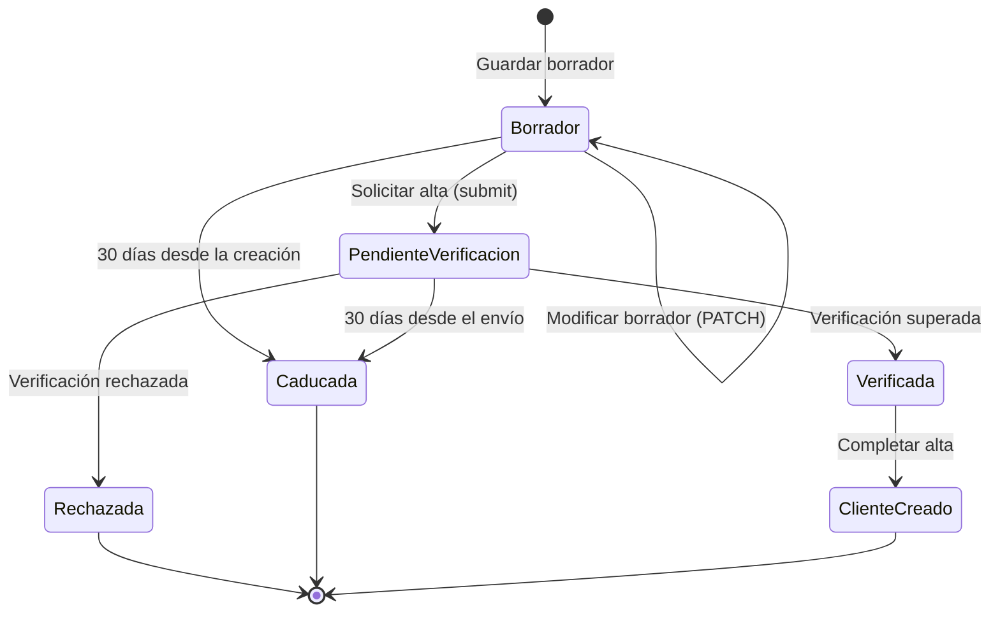

# Modelo de datos – 002 Alta digital de cliente (SPEC-002)

> Parte del **CÓMO**. Deriva de `spec.md`; contrato HTTP en [`contracts/openapi.yaml`](contracts/openapi.yaml).
> Rutas previstas para la implementación; el proveedor de verificación dummy ya existe en
> `backend/` (ver `plan.md`, ADR-002-08).

## 1. Entidad `OnboardingRequest` (solicitud de alta)

Código previsto: `backend/src/ClaimsManagement.Domain/Entities/OnboardingRequest.cs`.

| Campo | Tipo (.NET) | Tipo (API) | Obligatorio | Regla | REQ |
|---|---|---|---|---|---|
| `Id` | `Guid` | `string (uuid)` | Generado | Único, generado al crear | REQ-002-12 |
| `FirstName` | `string?` | `string` | Al enviar | No vacío / no solo espacios; opcional en Borrador | REQ-002-01, -02, -18 |
| `LastName` | `string?` | `string` | Al enviar | No vacío / no solo espacios; opcional en Borrador | REQ-002-01, -02, -18 |
| `DocumentType` | `DocumentType?` | `string (enum)` | Al enviar | Valor del catálogo; opcional en Borrador | REQ-002-01, -18 |
| `DocumentNumber` | `string?` | `string` | Al enviar | Según `DocumentType` (DNI/NIE con letra de control; Pasaporte solo obligatorio); se almacena **normalizado** | REQ-002-05..08 |
| `BirthDate` | `DateTime?` (solo fecha) | `string (date)` | Al enviar | ≥ 18 años a fecha civil de hoy en Europe/Madrid | REQ-002-04 |
| `Email` | `string?` | `string` | Al enviar | Formato de correo; opcional en Borrador | REQ-002-09, -18 |
| `MobilePhone` | `string?` | `string` | Al enviar | `^[67]\d{8}$`; opcional en Borrador | REQ-002-10, -18 |
| `AcceptsPrivacyPolicy` | `bool?` | `boolean` | Al enviar | Debe ser `true` al enviar | REQ-002-11 |
| `AcceptsMarketing` | `bool` | `boolean` | No | `false` si no se informa | REQ-002-11 |
| `Status` | `OnboardingStatus` | `string (enum)` | Generado | `Borrador` al crear (REQ-002-03) | REQ-002-03 |
| `CreatedAt` | `DateTime` (UTC) | `string (date-time)` | Generado | Instante de creación del borrador en UTC | REQ-002-12 |
| `UpdatedAt` | `DateTime` (UTC) | `string (date-time)` | Generado | Última modificación del borrador | REQ-002-19 |
| `SubmittedAt` | `DateTime?` (UTC) | `string (date-time)` | Generado | Instante del envío (PendienteVerificacion) | REQ-002-20 |
| `VerifiedAt` | `DateTime?` (UTC) | `string (date-time)` | Generado | Instante del resultado de verificación | REQ-002-22 |
| `ExpiresAt` | `DateTime?` (UTC) | `string (date-time)` | Generado | `CreatedAt + 30d` (Borrador) o `SubmittedAt + 30d` (PendienteVerificacion); nulo en estados finales | REQ-002-24 |
| `RejectionReason` | `string?` | `string` | Generado | Motivo devuelto por el proveedor cuando Rechazada | REQ-002-22 |

Invariantes:
- `OnboardingRequest.CreateDraft(...)` es la única forma de crear una solicitud y siempre fija
  `Status = Borrador` y un `Id` nuevo (REQ-002-03).
- El borrador admite cualquier subconjunto de datos (REQ-002-18); la validación de negocio
  completa solo se aplica en el envío (`Submit`), que es el único paso a `PendienteVerificacion`
  (REQ-002-20).
- Solo puede haber una solicitud **activa** (PendienteVerificacion, Verificada, ClienteCreado) por
  `(DocumentType, DocumentNumber)` normalizado; Borrador, Rechazada y Caducada no bloquean
  (REQ-002-16).
- Las transiciones se ejecutan con métodos de la entidad (`Submit`, `ApplyVerification`,
  `Complete`, `Expire`) que rechazan cualquier transición no listada en §3 (REQ-002-25).

## 2. Enumeración `DocumentType`

| Valor | Etiqueta UI | Código |
|---|---|---|
| `Dni` | DNI | 0 |
| `Nie` | NIE | 1 |
| `Pasaporte` | Pasaporte | 2 |

Cualquier otro valor se rechaza (mismo criterio que C-001-07).

## 3. Enumeración `OnboardingStatus` y máquina de estados

En SPEC-002 **se implementa la máquina de estados completa**.

| Valor | Código | Descripción |
|---|---|---|
| `Borrador` | 0 | Solicitud guardada, incompleta o aún no enviada |
| `PendienteVerificacion` | 1 | Solicitud enviada y validada, pendiente de verificación de identidad |
| `Verificada` | 2 | Identidad verificada por el proveedor |
| `Rechazada` | 3 | Verificación de identidad no superada (terminal) |
| `ClienteCreado` | 4 | Expediente de cliente creado; alta completada (terminal) |
| `Caducada` | 5 | Solicitud abandonada que superó su plazo (terminal) |

| Desde | Hacia | Disparador | Regla |
|---|---|---|---|
| (nuevo) | Borrador | `POST /api/onboarding-requests` | REQ-002-03, REQ-002-18 |
| Borrador | Borrador | `PATCH /{id}` | REQ-002-19 |
| Borrador | PendienteVerificacion | `POST /{id}/submit` | validación completa + duplicado activo (REQ-002-20, -16) |
| Borrador | Caducada | acceso tras `ExpiresAt` | REQ-002-24 (perezosa, C-002-08) |
| PendienteVerificacion | Verificada | `POST /{id}/verify` + proveedor verifica | REQ-002-22 |
| PendienteVerificacion | Rechazada | `POST /{id}/verify` + proveedor rechaza | REQ-002-22 (`RejectionReason`) |
| PendienteVerificacion | Caducada | acceso tras `ExpiresAt` | REQ-002-24 |
| Verificada | ClienteCreado | `POST /{id}/complete` | REQ-002-23 |

Cualquier otra transición es inválida y se responde 409 (REQ-002-25, AC-002-32).
Los estados terminales (Rechazada, ClienteCreado, Caducada) no admiten operaciones.

## 4. Proveedor de verificación de identidad

Código existente (entregado como scaffolding de esta spec, C-002-01):

| Componente | Código | Responsabilidad |
|---|---|---|
| `IIdentityVerificationService` | `backend/src/ClaimsManagement.Application/Interfaces/IIdentityVerificationService.cs` | `VerifyAsync(IdentityVerificationRequest)` → `IdentityVerificationResult` |
| `IdentityVerificationRequest` | `backend/src/ClaimsManagement.Application/Verification/IdentityVerificationRequest.cs` | Documento (tipo + número normalizado) y datos personales de la solicitud |
| `IdentityVerificationResult` / `IdentityVerificationOutcome` | `backend/src/ClaimsManagement.Application/Verification/` | `Verified` \| `Rejected` + `Reason` opcional |
| `DummyIdentityVerificationService` | `backend/src/ClaimsManagement.Infrastructure/Verification/DummyIdentityVerificationService.cs` | Dummy determinista: **rechaza** documentos normalizados que empiezan por `99`, **verifica** el resto |

El dummy es sustituible por un proveedor real sin cambiar la interfaz ni la máquina de estados.
Un fallo del proveedor (excepción/timeout) es un error técnico y **no** cambia el estado
(NFR-002-10, EC-002-22).

## 5. DTOs

| DTO | Código previsto | Contrato |
|---|---|---|
| `SaveOnboardingDraftRequest` | `backend/src/ClaimsManagement.Application/DTOs/SaveOnboardingDraftRequest.cs` | `#/components/schemas/SaveOnboardingDraftRequest` (todos opcionales) |
| `OnboardingResponse` | `backend/src/ClaimsManagement.Application/DTOs/OnboardingResponse.cs` | `#/components/schemas/OnboardingResponse` |
| `ValidationProblemDetails` | ASP.NET Core | `#/components/schemas/ValidationProblemDetails` |
| Tipos frontend | `src/types/onboarding.ts` | espejo de los anteriores |

## 6. Persistencia

`InMemoryOnboardingRepository` (singleton, `ConcurrentDictionary<Guid, OnboardingRequest>`) con un
segundo índice `(DocumentType, DocumentNumber)` normalizado para la unicidad **de solicitudes
activas** (REQ-002-16): el índice solo considera PendienteVerificacion, Verificada y ClienteCreado.
Operaciones: `AddDraft`, `GetById`, `UpdateDraft`, `Transition` (aplica la transición y el control
de caducidad perezoso con `TimeProvider`). La persistencia real (BD) queda fuera de SPEC-002.

**Datos personales**: `DocumentNumber`, `MobilePhone` y `Email` son datos de carácter personal; no se
registran en logs ni telemetría (NFR-002-08) y se conservarán cifrados cuando exista persistencia real.
