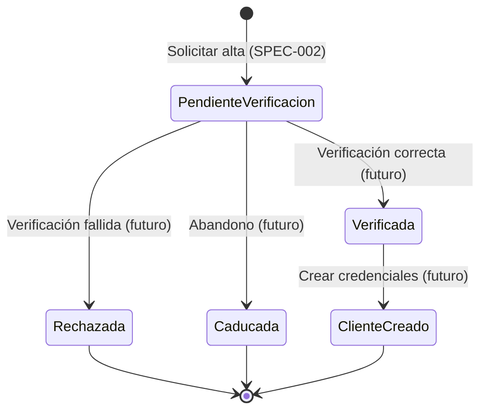

# Modelo de datos – 002 Alta digital de cliente (SPEC-002)

> Parte del **CÓMO**. Deriva de `spec.md`; contrato HTTP en [`contracts/openapi.yaml`](contracts/openapi.yaml).
> Rutas previstas (aún no implementadas, ver `plan.md`).

## 1. Entidad `OnboardingRequest` (solicitud de alta)

Código previsto: `backend/src/ClaimsManagement.Domain/Entities/OnboardingRequest.cs`.

| Campo | Tipo (.NET) | Tipo (API) | Obligatorio | Regla | REQ |
|---|---|---|---|---|---|
| `Id` | `Guid` | `string (uuid)` | Generado | Único, generado al crear | REQ-002-12 |
| `FirstName` | `string` | `string` | Sí | No vacío / no solo espacios | REQ-002-01, REQ-002-02 |
| `LastName` | `string` | `string` | Sí | No vacío / no solo espacios | REQ-002-01, REQ-002-02 |
| `DocumentType` | `DocumentType` | `string (enum)` | Sí | Valor del catálogo | REQ-002-01 |
| `DocumentNumber` | `string` | `string` | Sí | Según `DocumentType` (DNI/NIE con letra de control; Pasaporte solo obligatorio); se almacena **normalizado** | REQ-002-05..08 |
| `BirthDate` | `DateTime` (solo fecha) | `string (date)` | Sí | ≥ 18 años a fecha civil de hoy en Europe/Madrid | REQ-002-04 |
| `Email` | `string` | `string` | Sí | Formato de correo | REQ-002-09 |
| `MobilePhone` | `string` | `string` | Sí | `^[67]\d{8}$` | REQ-002-10 |
| `AcceptsPrivacyPolicy` | `bool` | `boolean` | Sí | Debe ser `true` | REQ-002-11 |
| `AcceptsMarketing` | `bool` | `boolean` | No | `false` si no se informa | REQ-002-11 |
| `Status` | `OnboardingStatus` | `string (enum)` | Generado | `PendienteVerificacion` al crear | REQ-002-03 |
| `CreatedAt` | `DateTime` (UTC) | `string (date-time)` | Generado | Instante de alta en UTC | REQ-002-12 |

Invariantes:
- `OnboardingRequest.Create(...)` es la única forma de crear una solicitud y siempre fija
  `Status = PendienteVerificacion` y un `Id` nuevo.
- Una solicitud solo se crea si `CreateOnboardingValidator` no devuelve errores (REQ-002-14).
- `(DocumentType, DocumentNumber)` normalizado es único: una segunda solicitud con el mismo par se
  rechaza con conflicto (REQ-002-16).

## 2. Enumeración `DocumentType`

| Valor | Etiqueta UI | Código |
|---|---|---|
| `Dni` | DNI | 0 |
| `Nie` | NIE | 1 |
| `Pasaporte` | Pasaporte | 2 |

Cualquier otro valor se rechaza (mismo criterio que C-001-07).

## 3. Enumeración `OnboardingStatus` y máquina de estados

En SPEC-002 **solo se implementa la creación en `PendienteVerificacion`**. La máquina de estados completa
se documenta como **referencia para historias posteriores**; sus transiciones están fuera de alcance.

| Valor | Código | Descripción |
|---|---|---|
| `PendienteVerificacion` | 0 | Solicitud registrada, pendiente de verificación de identidad |
| `Verificada` | 1 | Identidad verificada (selfie/videollamada/NFC) |
| `Rechazada` | 2 | Solicitud rechazada (verificación fallida o fraude) |
| `ClienteCreado` | 3 | Cliente dado de alta con credenciales |
| `Caducada` | 4 | Solicitud abandonada sin verificar (referencia, regla temporal pendiente) |

| Desde | Hacia | Alcance | Regla |
|---|---|---|---|
| (nuevo) | PendienteVerificacion | **SPEC-002** | REQ-002-03 |
| PendienteVerificacion | Verificada / Rechazada / Caducada | Futuro | pendiente de negocio (C-002-02) |
| Verificada | ClienteCreado | Futuro | pendiente de negocio (C-002-06) |

Cualquier otra transición es inválida.

## 4. DTOs

| DTO | Código previsto | Contrato |
|---|---|---|
| `CreateOnboardingRequest` | `backend/src/ClaimsManagement.Application/DTOs/CreateOnboardingRequest.cs` | `#/components/schemas/CreateOnboardingRequest` |
| `OnboardingResponse` | `backend/src/ClaimsManagement.Application/DTOs/OnboardingResponse.cs` | `#/components/schemas/OnboardingResponse` |
| `ValidationProblemDetails` | ASP.NET Core | `#/components/schemas/ValidationProblemDetails` |
| Tipos frontend | `src/types/onboarding.ts` | espejo de los anteriores |

## 5. Persistencia

`InMemoryOnboardingRepository` (singleton, `ConcurrentDictionary<Guid, OnboardingRequest>`) con un
segundo índice `(DocumentType, DocumentNumber)` normalizado para la unicidad (REQ-002-16).
La persistencia real (BD) queda fuera de SPEC-002.

**Datos personales**: `DocumentNumber`, `MobilePhone` y `Email` son datos de carácter personal; no se
registran en logs ni telemetría (NFR-002-08) y se conservarán cifrados cuando exista persistencia real.
